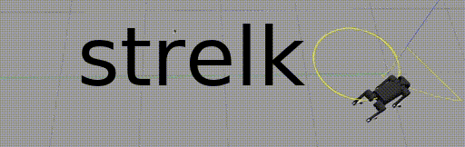

<p align="center">
  
</p>

# Overview

*strelka* is an open source modular library for quadruped locomotion, designed to provide researchers and developers with a flexible and extensible framework for implementing and testing a range of quadrupedal locomotion algorithms and controllers. *strelka* provides a seamless integration of planning, control, estimation, and communication modules, enabling users to develop and test complex locomotion strategies in simulation and on real hardware platforms.

The key feature of *strelka* is its modular design, which allows users to easily swap out and customize individual components of the locomotion pipeline. This means that users can quickly experiment with different control algorithms, sensors, and other hardware components, without having to rewrite large portions of the codebase. *strelka* also provides a decent set of pre-built controllers and locomotion primitives that users can leverage to quickly prototype and test new ideas.

It is **not** based on Robot Operating System (ROS). Instead it uses [Lightweight Communications and Marshalling (LCM) library](https://github.com/lcm-proj/lcm) and [Eigen](https://eigen.tuxfamily.org/index.php?title=Main_Page). The reason for that is the fact that majority of the control stack does not actually require ROS dependencies. So deployment speed on the real robot becomes much faster considering the amount of dependencies.

To aid in development and testing, [*strelka_ros*](https://github.com/RumblingTurtle/strelka_ros) includes a range of visualization and data-processing tools. These tools make it easy to visualize the robot's motion and sensor data, as well as to monitor the performance of the various control and planning algorithms. [*strelka_ros*](https://github.com/RumblingTurtle/strelka_ros) also includes support for the Gazebo simulation environment, allowing users to easily test and validate their locomotion algorithms in a realistic simulated environment.

Overall, *strelka* is an ideal framework for researchers and developers who are interested in experimenting with quadrupedal locomotion, and who are looking for a flexible and extensible software platform that can be easily customized to meet their specific needs.
## [Architechture overview](https://github.com/RumblingTurtle/strelka/wiki/Architechture-overview)
## [Implementing your robot](https://github.com/RumblingTurtle/strelka/wiki/Implementing-your-robot)
# Requirements
- Ubuntu (=18.04,20.04)
- [Eigen](https://eigen.tuxfamily.org/index.php?title=Main_Page) (tested and built on 3.3.7)
- [LCM](https://github.com/lcm-proj/lcm) 
# Installation
## Build using CMake
```
mkdir ~/strelka/build
cd ~/strelka/build
cmake -DCMAKE_BUILD_TYPE=[Debug|Release] ..
sudo make install
sudo ldconfig
```

## Run tests
```
cd build && ctest --vv
```

## Uninstall
```
cat ~/strelka/build/install_manifest.txt | sudo xargs rm 
```
#  LCM message profiling
Currently [lcm-mon](https://github.com/trehansiddharth/lcm-mon) does not support profiling with the message details. You can use my temporary fix for [lcm-mon](https://github.com/RumblingTurtle/lcm-mon/tree/lcm_gen_compatibility). 

```
lcm-mon -t ~/strelka/strelka_messages/lcm
```
